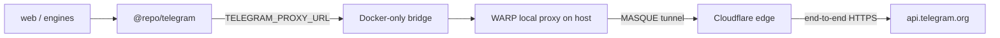

# Telegram WARP Proxy Design

**Date:** 2026-08-01  
**Status:** Approved for implementation planning

## Context

Production contact submissions reach `contact.submit` through Traefik, pass the
same-origin check, and then fail with `502 BAD_GATEWAY` while calling Telegram.
Both the `web` container and the host time out when connecting directly to
`api.telegram.org:443` over IPv4; IPv6 is unavailable. `TELEGRAM_BOT_TOKEN` and
`TELEGRAM_CHAT_ID` are present, but no outbound proxy is configured.

The production host runs Ubuntu 22.04 (`amd64`). Both `web` and `engines` run
Node.js 24.18.1. The host can reach Cloudflare's official Linux package
repository, while the Tor Project package repository times out from this
network.

## Goals

- Restore Telegram Bot API access for the public contact form and the shared
  Telegram integration.
- Use a free, reputable egress service without a public proxy list.
- Proxy only Telegram requests; do not change routing for S3, email, payments,
  AI providers, or other application traffic.
- Keep bot tokens and contact-form contents inside end-to-end TLS to
  `api.telegram.org`.
- Make installation, health checks, and rollback explicit and reproducible.

## Non-goals

- General-purpose VPN access for the host or containers.
- Publishing an HTTP or SOCKS proxy to the Internet.
- TLS interception, certificate installation, or payload inspection.
- Automatic retry of `sendMessage`; an ambiguous retry could duplicate a lead.
- Replacing Telegram with a different notification channel.

## Options Considered

### 1. Cloudflare WARP local proxy — selected

Install the official `cloudflare-warp` package and use the consumer client's
free registration in local proxy mode. The production host already reaches the
official package repository. WARP provides an isolated local HTTP/SOCKS proxy
over MASQUE without routing the host's default traffic through the tunnel.

Official references:

- [WARP Linux installation and consumer registration](https://developers.cloudflare.com/warp-client/get-started/linux/)
- [Cloudflare One local proxy mode](https://developers.cloudflare.com/cloudflare-one/team-and-resources/devices/cloudflare-one-client/configure/modes/)

Before installation changes routing, the implementation must inspect the
installed stable client's `warp-cli mode --help`. If local proxy mode is not
available with consumer registration, work stops without enabling full-tunnel
mode. A Zero Trust account or another design would then require separate user
approval.

### 2. Tor with Privoxy — rejected for the first rollout

Tor would preserve HTTPS encryption and can be exposed to Node as an HTTP proxy
through Privoxy. However, the production host currently cannot reach the Tor
Project package repository, relay connectivity is uncertain, exit addresses
change, and delivery has no useful reliability guarantee.

References:

- [Tor Project Debian/Ubuntu repository](https://support.torproject.org/apt/tor-deb-repo/)
- [Privoxy SOCKS forwarding](https://www.privoxy.org/user-manual/config.html#FORWARDING)

### 3. Cloudflare Worker relay — rejected

A free Worker relay would be reachable, but it would terminate application TLS
and process contact names, phone numbers, email addresses, and message content.
That expands the trust boundary unnecessarily compared with WARP tunnelling.

## Architecture



### WARP service

The official Cloudflare client runs as its normal host service. It uses free
consumer registration, MASQUE, and local proxy mode on loopback. It must not be
placed in full-tunnel mode.

The current WARP documentation uses port `40000` by default. The implementation
must discover the effective port from the installed client rather than assume
it.

### Docker-only bridge

WARP listens on host loopback, which Docker containers cannot reach directly.
A small `socat` systemd service forwards a TCP port bound only to Docker's host
gateway to the WARP loopback proxy. The service:

- uses fixed bridge port `40001`;
- binds to the address that `host.docker.internal:host-gateway` resolves to from
  a disposable container, never `0.0.0.0`;
- is ordered after Docker and `warp-svc`;
- restarts on failure;
- exposes no host port through Compose or the public firewall.

`web` and `engines` receive a `host.docker.internal:host-gateway` mapping. A
pre-deploy probe from a disposable container must prove that the mapping reaches
the bridge before application configuration changes.

### Telegram client

`@repo/telegram` gains optional `TELEGRAM_PROXY_URL` support. When it is set, the
client creates a reusable per-process `undici.ProxyAgent` and attaches it only
to Telegram Bot API requests. When it is absent, behavior remains unchanged.

The proxy setting is not implemented through process-wide `HTTP_PROXY` or
`HTTPS_PROXY`; those variables would unintentionally route unrelated outbound
traffic. `undici` becomes a direct package dependency rather than relying on a
transitive installation.

An injected `fetchFn` remains authoritative in tests and does not instantiate a
real proxy agent. The proxy URL is deployment configuration, never user input.
Only `http:` and `https:` proxy schemes are accepted.

### Deployment configuration

Add `TELEGRAM_PROXY_URL` to `.env.example` and Turbo's environment allow-list.
Production `.env` supplies:

```dotenv
TELEGRAM_PROXY_URL=http://host.docker.internal:40001
```

The existing `env_file` entries pass it to `web` and `engines`. Compose adds the
host-gateway mapping to those two services. No proxy credential is required and
no bot token is copied into WARP configuration.

## Data and Security Boundaries

- AnyNote sends the original HTTPS request through an HTTP CONNECT proxy. The
  bot token and contact payload stay encrypted between AnyNote and Telegram.
- Cloudflare can observe destination, timing, source, and traffic volume, but no
  TLS interception certificate is installed and Gateway TLS decryption is not
  enabled.
- The bridge is reachable only from local Docker networking. It is not a public
  or reusable Internet proxy.
- Logs must never print `TELEGRAM_BOT_TOKEN`, `TELEGRAM_CHAT_ID`, proxy URLs with
  credentials, or Telegram request URLs because request paths contain the bot
  token.

## Failure Handling

- If WARP or the bridge is unavailable, Telegram calls retain the existing
  timeout and return the existing neutral application error.
- No automatic `sendMessage` retry is added in this change.
- Service health is checked without tokens by connecting through the proxy to
  `https://api.telegram.org`; bot authentication is checked separately with a
  redacted `getMe` probe inside the application container.
- A failed capability, connectivity, or security check stops the rollout before
  the contact endpoint is exercised.

## Test Strategy

### Automated tests

- Existing direct and injected-fetch Telegram tests remain green.
- With `TELEGRAM_PROXY_URL` unset, requests use the existing fetch path.
- With a valid proxy URL, Telegram requests receive the dedicated dispatcher.
- Unsupported proxy schemes fail safely without exposing request URLs or
  tokens.
- Contact-router tests continue to map delivery failures to the neutral `502`
  response.

### Production verification

1. Verify WARP reports a connected local proxy without changing the host's
   default route.
2. Verify an unauthenticated HTTPS request reaches `api.telegram.org` through
   the Docker bridge.
3. Run a redacted `getMe` probe inside `web`; record only status and `ok`.
4. Submit one clearly marked test lead through
   `https://anynote.ru/api/trpc/contact.submit`.
5. Require HTTP 200 and confirmation that the test message appeared in the
   configured Telegram chat.
6. Check `web`, `engines`, Traefik, and WARP health after the test.

## Rollout

1. Land the application and Compose support while leaving
   `TELEGRAM_PROXY_URL` unset; this is behavior-preserving.
2. Install and capability-check the official WARP client.
3. Enable local proxy mode and verify host-side connectivity.
4. Install the Docker-only bridge and verify container connectivity.
5. Set `TELEGRAM_PROXY_URL`, recreate only `web` and `engines`, and run the
   production verification sequence.

## Rollback

1. Remove `TELEGRAM_PROXY_URL` from production `.env`.
2. Recreate only `web` and `engines`; direct behavior is restored.
3. Stop and disable the AnyNote WARP bridge.
4. Disconnect WARP. Package removal is optional and is not part of the emergency
   rollback path.

The existing direct Telegram failure remains visible after rollback, but the
rest of AnyNote is unaffected.

## Success Criteria

- A public contact submission returns HTTP 200 and arrives in Telegram.
- Telegram integration calls from both `web` and `engines` use WARP when the
  proxy variable is configured.
- Other outbound services do not use WARP.
- No proxy port is reachable from the public interfaces.
- No bot token, chat ID, proxy secret, or lead payload appears in diagnostic or
  service logs.
- Disabling one environment variable and recreating two containers restores the
  previous application path.
